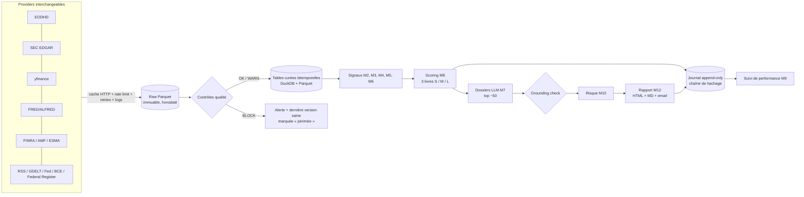

# Plan d'architecture — Scanner d'actions quotidien

> **Statut :** v0.1, 23/09/2026. **Proposition à valider** : aucune ligne de code n'est écrite avant ta validation.
> **S'appuie sur :** [`research_notes.md`](research_notes.md) (Étape 0), qui justifie chaque signal.

---

## 0. Résumé et décisions déjà actées

| Paramètre | Décision (tes réponses) | Conséquence de conception |
|---|---|---|
| Univers | **Par paliers** | Palier 1 : S&P 500, Nasdaq 100, STOXX 600 et SBF 120, soit environ 1 100 titres, avec l'analyse complète. Palier 2 : US tous marchés liquides et grandes/moyennes capitalisations émergentes, soit environ 3 000 à 4 000 titres, en filtre quantitatif seulement. Micro-caps exclues. |
| Exécution | **PEA + CTO** | Le PEA est long-only et limité à l'UE/EEE. La jambe short devient un **livre short « papier »** (validation), un **overlay de couverture** indiciel et, en option, des shorts via le **SRD** sur valeurs françaises éligibles (voir §1). |
| LLM | **Claude API** | Haiku 4.5 pour la classification de masse (Batch API), un grand modèle pour les dossiers du top ~50, avec un plafond de coût strict. |
| Infra | **GitHub Actions + email** | 3 workflows planifiés, stockage objet **Cloudflare R2** (gratuit jusqu'à 10 Go), rapport HTML par email. Le dépôt est **public** : minutes Actions gratuites, mais **aucune donnée brute de fournisseur dans git** (licences). |
| Horizons | Swing, moyen terme et long terme | **Trois « livres »** notés séparément : **S** (1 à 8 semaines), **M** (3 à 12 mois), **L** (5 ans et plus). |
| Langue | Français | Rapports, docstrings et documentation en français ; identifiants du code en anglais (convention Python). |

Le scanner vit dans le sous-dossier `daily-stock-scanner/`, pour ne pas mélanger ce projet avec tes notebooks existants.

---

## 1. Ce qui est irréaliste tel que demandé, et ce que je propose à la place

| Demande | Pourquoi c'est irréaliste | Alternative proposée |
|---|---|---|
| Style **long-short** avec **PEA + CTO** | Le PEA interdit la vente à découvert. En CTO chez un courtier français, le short « classique » n'est pas disponible, sauf le **SRD** sur une liste de valeurs françaises éligibles ; les CFD, turbos et puts n'ont pas été retenus. | (1) **Livre short papier**, suivi dans le journal, pour **valider** les signaux short comme dans la littérature. (2) **Overlay de couverture** : réduction de l'exposition nette, ETF inverse (certains sont éligibles au PEA, à vérifier au cas par cas) ou puts indiciels si tu l'acceptes plus tard. (3) Signal **« alléger / éviter »** sur tes lignes existantes. (4) Option : short **SRD** en CTO pour les valeurs françaises éligibles (drapeau `srd_eligible`). |
| **Tout** le marché EM avec des fondamentaux fiables | Les fondamentaux EM sont hétérogènes et rarement point-in-time. L'historique des délistés hors US se limite en gros aux 6 à 7 dernières années chez EODHD ✔. | Les EM restent au palier 2 en **quantitatif seul** (prix et momentum). La preuve factorielle EM vient de la base **JKP** (gratuite) plutôt que de notre propre backtest. Exécution de préférence via les **ADR** cotés aux US (CTO). |
| Backtest **point-in-time** partout | Il n'existe pas de données PIT gratuites en Europe avant ESEF (exercices 2020 et suivants). Les fondamentaux des fournisseurs sont souvent **retraités** : on y lit la valeur corrigée, pas celle publiée à l'origine. | **US** : fondamentaux « tels que déposés » via **SEC EDGAR** (chaque fait porte sa date de dépôt), exploitables à partir d'environ 2010. **UE** : décalage de publication **estimé et conservateur**, marqué `lag_estimated=true`, avec contrôle croisé ESEF à partir de 2021 et **instantanés quotidiens** conservés dès le jour 1. |
| Historique des **révisions de consensus** | L'historique point-in-time I/B/E/S coûte des milliers d'euros par an. | **Archivage quotidien** des instantanés de consensus dès le jour 1. Le signal est d'abord en OBS, puis validé en forward après environ 12 à 18 mois. |
| **X/Twitter**, StockTwits | X : plus de palier gratuit, facturation à l'usage d'environ 0,005 $ par post lu ✔. StockTwits : inscriptions fermées ✔. | Exclus. **Reddit** (gratuit, non commercial, sur approbation manuelle ✔) est optionnel. L'essentiel de l'actualité vient des **dépôts réglementaires, des agences de presse (RSS) et des canaux officiels**. |
| Déclarations politiques (Truth Social…) | Pas d'API officielle. | **Canaux officiels horodatés** : Federal Register API (décrets, proclamations tarifaires), Maison-Blanche, USTR, Commission européenne, Fed, BCE, BoE, discours des banquiers centraux agrégés par la BRI. **GDELT** pour la couverture mondiale. |
| Probabilités de scénarios | Elles n'ont pas de base objective. | Elles sont affichées comme **« probabilité subjective »** avec leur raisonnement, et leur **calibration est mesurée** dans le temps (score de Brier, diagramme de fiabilité). |
| Exécution « 1 h avant l'ouverture » via GitHub Actions | Le cron GitHub est **best-effort** : retards de 5 à 30 min courants, parfois plus, et exécutions occasionnellement abandonnées ✔. Les workflows planifiés sont **désactivés après 60 jours** sans activité sur un dépôt public ✔. | Planification **environ 2 h avant l'ouverture**, avec un **watchdog** qui alerte si le rapport manque. Le commit quotidien du journal maintient le dépôt actif. Un VPS reste possible en repli (voir §16). |
| Dépôt **public** et diffusion de recommandations | Les licences EODHD standard sont à **usage personnel** ✔. Diffuser publiquement des recommandations d'investissement entre dans le cadre de l'**article 20 de MAR** (présentation objective, conflits d'intérêts). | Données brutes et rapports **privés** (R2 + email). Pour un track record **prouvable** sans rien diffuser : chaque jour, on publie dans le dépôt public **l'empreinte SHA-256** du journal. C'est un engagement cryptographique qu'on pourra révéler plus tard pour ton portfolio. |

---

## 2. Sources de données et budget

> Tarifs vérifiés par recherche web le **23/09/2026**. Les pages des fournisseurs étaient bloquées par le proxy de mon environnement : **reconfirme sur leur site avant de t'abonner**.

### 2.1 Sources retenues

| Source | Offre et limites | Coût mensuel | Rôle | Phase |
|---|---|---|---|---|
| **SEC EDGAR** (companyfacts, submissions, texte intégral, Form 4, *13F Data Sets*, *Insider Transactions Data Sets*) | Gratuit. **10 requêtes/s max** et User-Agent déclaratif **obligatoire** ✔ | 0 € | Fondamentaux US PIT, dates d'annonce (8-K item 2.02), initiés, 13F, texte des 10-K (Lazy Prices) | 1 à 3 |
| **FRED / ALFRED** | Gratuit (clé API) | 0 € | Macro US avec **millésimes** (PIT) | 2 |
| BCE (Data Portal), OCDE (CLI), Eurostat, Fed (*excess bond premium*), indice EPU | Gratuit | 0 € | Macro zone euro, croissance, crédit, incertitude | 2 |
| **FINRA** short interest | Gratuit, API officielle, **2 publications par mois** ✔ | 0 € | Days-to-cover US | 2 |
| AMF (BDIF, API info-financière sur data.gouv.fr), BaFin, CONSOB… | Gratuit ✔ | 0 € | Initiés FR/UE (MAR art. 19), positions courtes publiques ≥ 0,5 % ✔, communiqués | 2-3 |
| **filings.xbrl.org** (ESEF) | Gratuit, xBRL-JSON ✔ | 0 € | Contrôle croisé des fondamentaux UE « tels que déposés » (2021 et suivants) | 2 |
| **yfinance** | Gratuit, **non officiel** ; erreurs `YFRateLimitError` encore signalées en 2026 ✔ | 0 € | Prototypage, secours, instantanés de consensus et de chaînes d'options | 1 |
| **Finnhub** (gratuit) | 60 appels/min, usage personnel ✔ | 0 € | Calendrier de résultats, surprises, news de sociétés US | 1-3 |
| **EODHD All-In-One** | **99,99 €/mois** ✔. Les briques séparées : EOD All World 19,99 € et Fundamentals 59,99 € ✔. 100 000 appels/jour ✔ ; **usage personnel** ✔ ; **délistés** (26 000+ tickers US depuis 2000 ✔) ; **bulk EOD** par place ✔ ; constituants historiques du S&P 500 depuis 2012 ✔ ; news incluses | **~100 €** | **Source principale** : prix et fondamentaux monde, délistés (backtest sans biais du survivant), calendriers | fin de Phase 1 |
| **Claude API** | Haiku 4.5 : 1 $ / 5 $ par million de tokens (entrée / sortie) ; Sonnet 5 : 2 $ / 10 $ ; Opus 5 : 5 $ / 25 $ ; **Batch API -50 %** ; lectures de cache à 0,1× (tarifs Anthropic, référence juin 2026) | **plafond 80 à 90 $** | Classification des nouvelles, dossiers et scénarios | 3 |
| **Cloudflare R2** | **10 Go gratuits**, sortie de données gratuite ✔ | 0 € | Stockage Parquet/DuckDB, rapports, journal | 1 (fin) |
| **GitHub Actions** | Dépôt public : runners standard gratuits | 0 € | Orchestration | 1 (fin) |
| Reddit API | Gratuit non commercial, approbation manuelle ✔ | 0 € | Attention et hype (optionnel) | 3 |

### 2.2 Évaluées mais non recommandées (pour l'instant)

| Source | Prix constaté | Raison |
|---|---|---|
| FMP Ultimate | 149 $/mois (facturé annuellement) ✔ | Fait doublon avec EODHD et SEC (13F, transcriptions). Éventuellement plus tard, comme **seconde source** de contrôle croisé. |
| Massive (ex-Polygon.io, renommé fin 2025 ✔) | 29 à 199 $/mois ✔ | US uniquement ; utile pour l'intraday, qui ne sert pas ici. |
| Quiver Quantitative API | 30 $/mois (Hobbyist) ✔ | Les transactions des parlementaires n'ont pas de preuve de surperformance (Belmont et al. 2022) ; des sources officielles gratuites existent. |
| X API | ~0,005 $ par post lu ✔ | Hors budget. |
| Unusual options flow | ~50 à 250 $/mois | Preuve fondée sur des données non publiques. |

### 2.3 Budget mensuel par phase (estimation)

| Phase | Données | LLM | Infra | **Total** | Marge sur 300 € |
|---|---|---|---|---|---|
| 1 (développement) | 0 €, puis ~100 € à partir du backtest | 0 € | 0 € | **0 à 100 €** | 200 à 300 € |
| 2 | ~100 € | 0 € | 0 € | **~100 €** | ~200 € |
| 3-4 (régime de croisière) | ~100 € | ~45 à 80 € | 0 € (VPS optionnel à 5-10 €) | **~150 à 190 €** | ~110 à 150 € |

La marge sert de réserve pour une seconde source de fondamentaux (contrôle croisé), un VPS en repli, ou le choix Opus plutôt que Sonnet pour les dossiers.

---

## 3. Univers

### 3.1 Univers « live » (rapport quotidien)

| Palier | Composition | Traitement |
|---|---|---|
| **1** (~1 100 titres uniques) | S&P 500 ∪ Nasdaq 100 ∪ STOXX Europe 600 ∪ SBF 120 | Tous les modules. Dossier LLM si le titre entre dans le top ~50 d'un livre. |
| **2** (~3 000 à 4 000) | US hors palier 1 avec capitalisation ≥ 300 M$, **volume quotidien médian (60 jours) ≥ 1 M$** et prix ≥ 3 $ ; Europe hors palier 1 avec des seuils équivalents en EUR ; EM : capitalisation ≥ 1 Md$ et volume ≥ 2 M$/jour, **ADR** de préférence | Modules quantitatifs et fondamentaux si disponibles. Promotion vers l'analyse approfondie **uniquement** si le score le justifie. |

- **Exclus :** micro-caps, OTC/pink sheets, coquilles SPAC, ETF et fonds, actions de préférence. Pour les multi-classes, on garde la plus liquide.
- **Drapeaux par titre :**
  - `pea_eligible` : siège dans l'UE/EEE ; Royaume-Uni et Suisse exclus. C'est une **approximation à confirmer** auprès du courtier.
  - `srd_eligible` : valeurs françaises.
  - `ttf_applicable` : liste officielle annuelle des sociétés françaises de plus d'un milliard d'euros ✔.
  - `adr`, `currency`, `country`.

### 3.2 Univers de backtest (sans biais du survivant)

Un univers **défini par des règles à chaque date de rebalancement** (top N par capitalisation dans chaque région, avec les filtres de liquidité ci-dessus), calculé sur une base de prix **qui inclut les délistés**. Ce choix évite de dépendre d'historiques de composition d'indices sous licence :
- **US** : top 1 000 ;
- **Europe** : top 600 ;
- **EM** : top 500, en quantitatif seul.

**Limite connue :** hors US, l'historique des délistés d'EODHD couvre surtout les 6 à 7 dernières années ✔. Les backtests européens antérieurs à environ 2019 sont donc **marqués « potentiellement biaisés »**.

---

## 4. Architecture logique

### 4.1 Flux de données



### 4.2 Modèle de données **bitemporel** : la garantie anti-look-ahead

Chaque fait stocké porte trois horodatages :
- `event_date` ou `period_end` : **à quoi** se rapporte la donnée ;
- `available_at` : **quand elle est devenue publique**. Pour un 10-K, c'est la date d'acceptation EDGAR ; pour un short interest FINRA, la date de publication.
- `ingested_at` : **quand nous l'avons collectée**.

**Règle d'or :** tout calcul de signal reçoit un `as_of` (horodatage de décision) et lit exclusivement à travers une vue `PitView(as_of)`, qui filtre `available_at <= as_of`.

**Quand la date de publication réelle est inconnue**, par exemple pour les fondamentaux européens d'un fournisseur, on applique un **décalage conservateur** paramétré dans `config/sources.yaml` et on pose le drapeau `lag_estimated = true`. Décalages par défaut :
- 120 jours après la clôture annuelle ;
- 75 jours après un semestre ;
- 60 jours après un trimestre.

**Tests obligatoires** (Phase 1) :
1. **Empoisonnement du futur** : on injecte des valeurs aberrantes avec `available_at > as_of` et l'on vérifie que **tous** les signaux restent identiques.
2. **Rejeu** : recalculer le score d'une date passée avec les données actuelles doit donner le même résultat que celui archivé ce jour-là, en dehors des corrections de données documentées.

### 4.3 Tables principales

| Table | Contenu clé |
|---|---|
| `securities` | id interne, ISIN, tickers historisés, place, devise, pays, secteur, drapeaux PEA/SRD/TTF, dates de cotation et de délistage |
| `prices_daily` | OHLCV brut et ajusté, source, `ingested_at` (les ajustements sont recalculés à partir des corporate actions) |
| `corporate_actions` | splits, dividendes, changements de ticker |
| `fundamental_facts` | concept, valeur, unité, période, formulaire, **`available_at`**, `lag_estimated`, source, **version telle que déposée** |
| `events` | annonces de résultats, AG, calendriers macro, réunions de banques centrales, échéances d'options, élections |
| `insider_tx`, `holdings_13f`, `short_interest`, `short_positions_eu` | données de flux avec leur date de publication réelle |
| `macro_series` | valeur **par millésime** (`vintage_date`) |
| `news_items` | URL, source, `published_at`, `fetched_at`, empreinte du texte, entités, labels LLM, version du prompt |
| `signals`, `scores` | par `run_id`, `as_of`, titre, livre : valeur brute, valeur normalisée, couverture, contributions |
| `dossiers` | sortie JSON du LLM, sources citées, statut du grounding, modèle, version du prompt, coût |
| `journal` | recommandations **append-only**, chaînage SHA-256 |
| `runs` | empreinte de la config, SHA git du code, snapshots de données, résultats des contrôles qualité, coûts |

---

## 5. Modules

Pour chaque module : entrées, sorties, points de conception. Le détail des signaux et leur justification sont dans `research_notes.md` §10.

### Module 1 : univers et données de marché
- **Interface `Provider`** (protocole Python) : `get_prices`, `get_fundamentals`, `get_events`… Chaque implémentation gère :
  - un **cache disque** (clé = requête ; durée de vie par type de donnée) ;
  - un **rate limiter** (token bucket paramétré par source, par exemple SEC à 8 requêtes/s pour garder une marge sous la limite de 10) ;
  - des **retries** avec backoff exponentiel ;
  - des **logs structurés** : chaque appel est tracé avec l'URL (sans la clé), le statut et la durée.
- **Priorités et repli** configurables : si EODHD tombe, on bascule sur yfinance, avec un marquage « source de secours » dans le rapport.
- **Contrôle croisé** quotidien des clôtures entre deux sources sur un échantillon ; un écart supérieur à 1 % déclenche une alerte.

### Module 2 : analyse fondamentale
- Rentabilité, qualité, valorisation, santé financière (Altman, Piotroski, Beneish) et « croissance ». La croissance est **redéfinie** en surprises, révisions et croissance de la rentabilité : la croissance passée brute n'est **pas** prédictive (voir la note).
- Tout est calculé en **percentiles sectoriels** (secteur × région).
- **Financières** (banques, assurances) : Altman, Beneish, EV/EBIT et accruals ne s'appliquent pas. Un jeu de ratios dédié est utilisé (P/B, ROE, levier réglementaire si disponible) et les exclusions sont marquées dans le rapport.
- **Tests** : chaque ratio est testé sur des **cas calculés à la main**, puis sur un vrai 10-K dont on recalcule les valeurs manuellement dans le test.

### Module 3 : quant et technique
- Momentum 12-1 et 6-1 (mis à l'échelle de la volatilité), momentum résiduel (régression sur facteurs, 36 mois glissants), force relative par rapport au secteur et à l'indice, plus haut 52 semaines, faible volatilité et bêta, volume anormal, réaction aux publications de résultats (EAR sur 3 jours), et Trend Template et VCP en OBS.
- Volatilité et drawdown servent au risque, pas au score alpha.

### Module 4 : smart money et flux
- **Form 4** : on ne retient que les achats sur le marché (code P) ; clusters, initiés « routiniers » exclus, pondération CEO/CFO, décroissance temporelle.
- **AMF (MAR art. 19)** : un parseur dédié, validé sur des exemples réels en Phase 2.
- **13F** : liste de fonds **configurable** (`config/funds.yaml`), limitée aux gérants **fondamentaux concentrés** (Berkshire, Pershing Square, cubs de Tiger…). Les quants sont exclus (voir la note §3.1). Les **CIK sont résolus et vérifiés** sur EDGAR à l'installation, pas saisis de mémoire.
  - **Date de la donnée et retard toujours affichés** : par exemple, « positions au 30/06, publiées le 14/08, âge 40 jours ».
- **Short interest FINRA** (days-to-cover) et **positions courtes publiques UE**.
- **Parlementaires** : contexte uniquement.
- **Options** : archivage quotidien des chaînes US pour construire l'historique (OBS).

### Module 5 : actualité et discours
Détails au §8. En résumé : ingestion multi-sources, déduplication, liaison aux entités, **nouveauté**, classification LLM, propagation d'impact, score de hype (pénalité), attention.

### Module 6 : régime macro
- **Indicateurs** : pente de courbe (10 ans - 3 mois), spreads de crédit et *excess bond premium*, inflation (CPI et HICP), OCDE CLI, dollar, pétrole, VIX, EPU.
- **Régime** croissance × inflation, calculé **avec les millésimes ALFRED**.
- **Usage** : contexte et **risque** (exposition nette recommandée, overlay de tendance indiciel). Les pondérations de facteurs par régime restent en **OBS** tant qu'elles ne battent pas l'équipondération hors échantillon.

### Module 7 : anticipation et scénarios
Détails au §8.3. Il couvre :
- un calendrier de catalyseurs **issu des données**, jamais inventé par le LLM ;
- un arbre de scénarios (haussier / central / baissier), avec déclencheurs, indicateurs à surveiller et probabilités **subjectives** ;
- ce qui est déjà dans les prix ;
- les effets de second ordre ;
- un **red team** obligatoire ;
- la condition d'invalidation.

### Module 8 : scoring et classement
Détails au §6.

### Module 9 : validation et backtest
Détails au §7.

### Module 10 : gestion du risque
Détails au §9.

### Module 11 : pipeline quotidien
Détails au §10.

### Module 12 : rapport quotidien
Détails au §11.

---

## 6. Scoring (Module 8)

1. **Normalisation**, par date :
   - winsorisation au 1er et au 99e percentile ;
   - rang percentile **au sein du groupe secteur × région** (US / Europe / EM). Si le groupe compte moins de 15 titres, on se replie sur le secteur mondial, puis sur la région ;
   - transformation *rank-gauss* (percentile → z par la loi normale inverse), bornée à ±3.
2. **Signe** : chaque signal est orienté pour qu'une valeur haute soit « bonne pour un long ». Le signe attendu est **pré-enregistré** dans `signals.yaml`.
3. **Score de module** = moyenne des z des signaux **actifs** (statut CŒUR validé) du module.
   - Il faut une couverture minimale de 60 % des signaux, sinon le module est neutre (0) avec un drapeau.
   - Le composite est **rétréci vers 0** en proportion de la couverture manquante : pas d'imputation silencieuse.
4. **Composite par livre** = somme pondérée des modules, avec des pondérations versionnées dans `config/weights.yaml`. **Au départ, les familles de signaux sont équipondérées**. On ne change une pondération qu'avec une preuve hors échantillon, et chaque changement est consigné (date, raison, rapport de backtest associé).

| Livre | Familles incluses au départ (sous réserve de validation) |
|---|---|
| **S** (swing) | Momentum court et sectoriel, plus haut 52 semaines, réaction aux résultats (EAR/SUE), volume anormal, achats d'initiés, days-to-cover. En OBS : news LLM, révisions, Trend Template. |
| **M** (moyen terme) | Value, qualité, momentum 12-1 et résiduel, faible risque, émissions et investissement, initiés, short interest. En OBS : 13F, Lazy Prices. |
| **L** (long terme) | Qualité (dont la stabilité du ROIC et des marges), sécurité (levier, Altman), value, faible risque, croissance de la rentabilité. En OBS : 13F des gérants « long terme », P/E par rapport à l'historique propre. |

5. **Pénalités** (additives sur le z composite, paramétrables) :
   - **liquidité faible** : exclusion sous le seuil, pénalité juste au-dessus ;
   - **Beneish** M > -1,78 ;
   - **détresse** Altman ;
   - **hype suspecte** ;
   - **événement binaire imminent non maîtrisé** : pénalité pour le livre S (résultats sous 3 séances, décision réglementaire, procès), drapeau pour les livres M et L ;
   - **crowding** (OBS).
6. **Shorts papier** : les derniers rangs de chaque livre, à condition d'une liquidité élevée et en excluant le risque de squeeze (DTC très élevé avec momentum positif). Le drapeau `srd_eligible` est affiché.
7. **Explicabilité** : pour chaque titre du top, un tableau des **contributions** par module et par signal, avec la valeur brute, le percentile sectoriel et la contribution au score. Les **changements par rapport à la veille** (entrées et sorties) sont attribués au module dont la contribution a le plus changé.

---

## 7. Validation et backtest (Module 9)

### 7.1 Périodes et découpage

| Zone | Prix | Fondamentaux PIT | Découpage |
|---|---|---|---|
| US | 2000 et après (EODHD, délistés inclus) | ~2010 et après (EDGAR XBRL tel que déposé) | Conception 2010-2018, **test hors échantillon 2019-2026**, consulté **une fois** par décision et journalisé |
| Europe | Selon EODHD (délistés fiables ~2019 et après) | Décalage estimé ; ESEF à partir de 2021 | Walk-forward court, résultats marqués « indicatifs » |
| EM | Selon EODHD | — | Quantitatif seul ; **prior externe = base JKP** |

- **Walk-forward** avec fenêtre croissante : tout paramètre estimé (bêtas, résidus) ne l'est **qu'avec le passé**.
- **Rebalancement** : S hebdomadaire, M mensuel, L trimestriel.

### 7.2 Coûts (`config/costs.yaml`)
- **Courtage** selon ton courtier (à paramétrer).
- **Demi-spread** estimé par liquidité, via l'estimateur haut-bas de Corwin & Schultz (2012) à défaut de données bid/ask.
- **Taxes** : **TTF française de 0,4 %** ✔ à l'achat, ITF italienne, taxe espagnole, stamp duty britannique.
- **Impact** en racine carrée de la participation (négligeable pour tes tailles, mais modélisé).
- **Coût d'emprunt** pour les shorts papier (hypothèse paramétrée ; les titres difficiles à emprunter sont exclus).

### 7.3 Métriques et sorties
- **Portefeuilles** : rendement, volatilité, Sharpe, Sortino, drawdown maximal, turnover, hit rate, **Deflated Sharpe**.
- **Signaux** : **IC de rang** (Spearman) et t-stat Newey-West, **décroissance de l'IC** à 1, 5, 21, 63, 126 et 252 jours, spreads par quantile, corrélation entre signaux.
- **Benchmarks** : univers équipondéré, indice de référence (ETF S&P 500 et STOXX 600), momentum 12-1 simple.
- **Rapport de validation** en Markdown et HTML versionné, avec la liste explicite : signaux **promus**, maintenus en **OBS**, **retirés**, et pourquoi.

### 7.4 Règles de décision (pré-enregistrées)
- **Signal issu de la littérature** : il est promu en CŒUR si, hors échantillon, il a le **bon signe**, un IC avec t ≥ 2 et un spread net de coûts positif.
- **Signal « maison »** : t ≥ 3 et Deflated Sharpe > 0.
- **Rétrogradation en OBS** si l'IC glissant sur 24 mois change de signe avec t ≤ -1, ou si le signal perd plus de la moitié de sa force par rapport à sa validation.

### 7.5 Journal prospectif (paper trading), **dès la fin de la Phase 1**
- Chaque recommandation est enregistrée : horodatage UTC, `run_id`, livre, sens, score et décomposition, prix de référence, invalidation, horizon, empreinte de la thèse et des sources, modèle et version du prompt.
- **Prix de référence** : l'**ouverture suivante**, pour ne jamais utiliser une clôture déjà connue.
- Le journal est **append-only** et **chaîné par hachage** : chaque ligne contient l'empreinte de la précédente. L'empreinte de tête est **committée chaque jour** dans le dépôt public (engagement vérifiable, voir §1).
- **Évaluation quotidienne** :
  - rendement par rapport au benchmark sectoriel, par livre et par signal ;
  - hit rate ;
  - **calibration des probabilités de scénarios** (Brier) ;
  - version **anonymisée** pour les signaux LLM (Glasserman & Lin).

---

## 8. Pipeline LLM (Modules 5 et 7)

### 8.1 Étapes

| Étape | Traitement | Outil |
|---|---|---|
| 0. Ingestion | RSS (agences, sociétés, régulateurs), EDGAR 8-K et 6-K, AMF, GDELT, Fed, BCE, BRI, Federal Register, Reddit (optionnel) | Code |
| 1. Filtrage déterministe | URL canonique, **déduplication** (SimHash/MinHash), **liaison aux entités** (dictionnaire tickers / noms / alias + correspondance floue), pertinence (univers ou source macro/politique), **nouveauté** (similarité avec les 7 derniers jours pour la même entité) | Code (0 €) |
| 2. Classification | Type d'événement (résultats, M&A, régulation, politique commerciale, litige, produit, management…), entités et rôle, sentiment par entité [-1, 1], nouveauté, crédibilité (prior selon la source), horizon, secteurs/pays/matières premières touchés, **faits clés avec citation verbatim** | **Haiku 4.5**, sortie structurée JSON, **Batch API** |
| 3. Propagation d'impact | Graphe d'exposition : secteur → secteur (tables entrées-sorties BEA), client → fournisseur (10-K, clients > 10 % du CA, **extraits avec citation**), exposition géographique du CA | Code + LLM, extraction mise en cache par dépôt |
| 4. Dossiers (top ~50) | Thèse en 5 lignes, catalyseurs datés (**issus du calendrier**), scénarios haussier / central / baissier (déclencheurs, indicateurs à surveiller, probabilité **subjective** raisonnée), « déjà dans les prix ? » (face au consensus et à la valorisation implicite), effets de second ordre, **red team**, invalidation | Grand modèle (voir §8.2), rafraîchissement **incrémental** |
| 5. Contrôles | Validation du schéma JSON ; **grounding** : chaque nombre et chaque date de la sortie doit figurer dans le dossier de données fourni (avec tolérance), et chaque affirmation référence un `source_id` du dossier. En cas d'échec : une relance, puis le dossier est marqué « non vérifié » et exclu de la section thèse. | Code |

**Principes :**
- Le LLM ne reçoit **que** le dossier de données (scores, fondamentaux, nouvelles avec leurs URL). Il lui est interdit d'introduire un fait absent du dossier.
- Le red team est **obligatoire** : une thèse sans red team est rejetée par le validateur.

### 8.2 Modèles et coût estimé (hypothèses explicites)

Les identifiants des modèles sont dans la config (`claude-haiku-4-5`, `claude-opus-5`, `claude-sonnet-5`), pour pouvoir en changer sans toucher au code.

| Poste | Hypothèses | Coût standard | Coût avec Batch (-50 %) |
|---|---|---|---|
| Classification, **Haiku 4.5** | ~800 nouvelles/jour après filtrage, soit ~24 000/mois ; ~1 500 tokens en entrée (dont ~1 000 de prompt système en cache) et ~300 en sortie | ~50 $/mois | **~25 $/mois** |
| Dossiers, **Opus 5** | ~15 dossiers neufs ou rafraîchis par séance, soit ~320/mois ; ~30 000 tokens en entrée et ~6 000 en sortie (réflexion incluse) | ~96 $/mois | **~48 $/mois** |
| Dossiers, variante **Sonnet 5** | mêmes hypothèses | ~38 $/mois | ~19 $/mois |

- **Total estimé** : ~75 $/mois (Haiku + Opus, en batch) ou ~45 $/mois (Haiku + Sonnet, en batch). Ce sont des **estimations** : le coût réel sera mesuré (`response.usage`) et affiché dans chaque rapport.
- **Garde-fou** : plafond mensuel dans la config (par défaut 90 $). Au-delà de 80 % du plafond, on passe en mode dégradé : dossiers du top 10 uniquement et classification des sources prioritaires seulement.
- **Délai du batch** : il n'est pas garanti (jusqu'à 24 h). Si le batch n'est pas terminé à l'heure limite, on bascule sur des appels standard pour les éléments prioritaires.
- **Recommandation** : Opus 5 pour les dossiers, car la qualité du raisonnement contradictoire et des scénarios est le cœur du Module 7. On pourra comparer à Sonnet 5 sur un échantillon et **décider sur mesure**. Le choix t'appartient.
- **Prompts versionnés** (`prompts/*.md` + empreinte) : chaque sortie est rattachée à sa version de prompt pour mesurer la performance **par version**.

---

## 9. Gestion du risque (Module 10)

- **Dimensionnement** :
  - poids inversement proportionnels à la volatilité, pour viser une volatilité de portefeuille (paramètre, par exemple 12 à 15 % annualisés pour le livre long) ;
  - plafonds : 5 à 8 % par ligne, 25 % par secteur, et un plafond par pays ;
  - taille ≤ 1 % du volume quotidien moyen.
- **Corrélations** : regroupement hiérarchique sur les rendements quotidiens à 1 an, avec **2 idées maximum par grappe** dans le top. Une carte des corrélations accompagne le rapport.
- **Expositions factorielles du panier** : régression sur les facteurs (Fama-French US et Europe, gratuits ; JKP). Alerte en cas de concentration, par exemple un panier qui est en réalité « long croissance / duration longue ».
- **Invalidation** de chaque thèse :
  1. **logique**, issue des données : par exemple « marge brute du prochain trimestre < X % » ou « révisions négatives > Y % sur 30 jours » ;
  2. **technique** : 2,5 × ATR(20) pour le livre S, clôture sous la moyenne mobile 200 jours pour le livre M ;
  3. **temporelle** : échéance de l'horizon.

  Les invalidations sont suivies chaque jour, et celles qui se déclenchent sont signalées en tête de rapport.
- **Overlay de couverture** (régime et tendance indicielle) : exposition nette recommandée (par exemple 100 %, 70 % ou 40 %), avec les instruments possibles selon l'enveloppe (PEA ou CTO).

---

## 10. Pipeline et automatisation (Module 11)

### 10.1 Planification (heures UTC ; Paris = UTC+2 en été, UTC+1 en hiver)

| Workflow | Cron (UTC) | Contenu |
|---|---|---|
| `nightly-ingest` | 02:30, du mardi au samedi | Prix EOD en bulk, nouveaux dépôts EDGAR, Form 4, FINRA, positions courtes UE, macro. Soumission du **batch LLM** de classification des nouvelles de la nuit. Contrôles qualité. |
| `eu-preopen` | 05:00, du lundi au vendredi | Résultats du batch et différentiel de nouvelles, puis signaux, scores, dossiers, risque et **rapport** par email vers 06:00 UTC, **au moins 1 h avant** l'ouverture européenne (07:00 UTC en été, 08:00 en hiver), avec une marge pour les retards du cron. |
| `us-preopen` | 11:45, du lundi au vendredi | Mise à jour avant l'ouverture américaine (13:30 UTC en été, 14:30 en hiver) : nouvelles européennes et américaines de la matinée, rapport **différentiel**. |
| `ci` | à chaque push | ruff, mypy, pytest |
| `watchdog` | 06:45 et 12:45 | Alerte par email si le rapport attendu est absent |

- **Calendriers de bourse** : bibliothèque `exchange_calendars`. On ne lance rien si les deux marchés sont fermés.
- **Changement d'heure** : les crons sont fixes en UTC et les créneaux ont été choisis pour rester valides dans les deux régimes.

### 10.2 Stockage
- Bucket R2 privé : `raw/` (immuable, partitionné par source et par date), `curated/` (Parquet), `db/` (instantané DuckDB), `reports/`, `journal/`. DuckDB lit directement le Parquet sur un stockage compatible S3.
- **Dans git (public)** : code, config, prompts, **empreintes** quotidiennes du journal, rapports de validation agrégés. **Jamais** de données brutes de fournisseur.
- Surveillance du volume : ~1 à 3 Go attendus, alerte à 8 Go (limite gratuite : 10 Go).
- Note : le `.gitignore` racine ignore déjà `*.csv`. Le journal sera en JSONL et en Parquet.

### 10.3 Secrets
- **GitHub Secrets** : `EODHD_API_KEY`, `ANTHROPIC_API_KEY`, `FRED_API_KEY`, `SEC_USER_AGENT` (nom + email de contact exigés par la SEC), `R2_*`, `SMTP_*`, `REPORT_TO`.
- **En local** : fichier `.env` (ignoré par git) lu par `pydantic-settings`.
- Hook pre-commit `gitleaks` ; **aucune clé en dur**.

### 10.4 Contrôles qualité et alertes

| Contrôle | Règle |
|---|---|
| Fraîcheur | La dernière date est bien la séance attendue |
| Complétude | ≥ 95 % de l'univers couvert |
| Valeurs aberrantes | Rendement quotidien > 50 % sans opération sur titre ; écart entre sources > 1 % |
| Cohérence comptable | Actif ≈ passif + capitaux propres ; signes attendus |
| Schéma | Dérive du format des sources |
| Doublons | Détection |

- **Sévérité** : `BLOCK` (source écartée, dernière version saine marquée « périmée » dans le rapport) ou `WARN`.
- Chaque exécution produit un **manifeste** (config, SHA du code, données, contrôles qualité, coûts). Les logs sont en JSON structuré.

---

## 11. Rapport quotidien (Module 12)

HTML (email, CSS inline) et Markdown (archive), en français.

1. **En-tête** : date, heure des données, sources indisponibles ou périmées (**explicite**), coût LLM du jour et du mois.
2. **Régime de marché et macro/politique du jour** : régime, indicateurs clés, événements (banques centrales, décisions commerciales) avec leurs sources.
3. **Exposition nette recommandée** (overlay) et justification.
4. **Top idées par livre (S, M, L)**, longs et shorts papier. Pour chacune :
   - la thèse en 5 lignes ;
   - la décomposition du score ;
   - les catalyseurs datés ;
   - les scénarios avec probabilités **subjectives** ;
   - le red team ;
   - les risques ;
   - le niveau d'invalidation ;
   - les drapeaux PEA/SRD/TTF.
5. **Changements par rapport à la veille** : entrées et sorties, avec leur cause.
6. **Alertes** : hype suspecte, événements binaires, Beneish, invalidations déclenchées, risque de squeeze.
7. **Performance** des recommandations passées (journal) et calibration.
8. **Qualité des données** et **sources** : chaque affirmation factuelle renvoie par une note [n] à une table URL + horodatage.

Chaque affirmation porte l'un de ces statuts : **Fait** (sourcé), **Estimation** (méthode indiquée) ou **Hypothèse**.

---

## 12. Structure du dépôt

```
daily-stock-scanner/
├── README.md                  # installation, configuration des API, lancement, limites
├── research_notes.md          # Étape 0
├── ARCHITECTURE.md            # ce document
├── pyproject.toml             # Python 3.12, dépendances (géré par uv)
├── config/
│   ├── settings.yaml          # univers, seuils de liquidité, horaires, plafonds
│   ├── signals.yaml           # catalogue : id, module, livres, signe attendu, statut, références
│   ├── weights.yaml           # pondérations versionnées + journal des changements
│   ├── funds.yaml             # fonds suivis en 13F (noms ; CIK résolus sur EDGAR)
│   ├── sources.yaml           # providers, priorités, limites de débit, décalages de publication
│   └── costs.yaml             # courtage, spreads, taxes (TTF…), coût d'emprunt
├── prompts/                   # prompts LLM versionnés
├── src/scanner/
│   ├── core/                  # config (pydantic), logging, calendriers, types, PitView
│   ├── data/
│   │   ├── providers/         # base.py, eodhd.py, sec_edgar.py, yfinance_.py, fred.py, finnhub.py, finra.py, amf.py…
│   │   ├── cache.py, ratelimit.py
│   │   ├── store.py           # Parquet + DuckDB, modèle bitemporel
│   │   ├── universe.py
│   │   └── quality.py         # contrôles qualité
│   ├── fundamentals/          # quality.py, valuation.py, health.py (altman/piotroski/beneish), growth.py
│   ├── quant/                 # momentum.py, trend.py, volatility.py, volume.py, earnings_reaction.py
│   ├── flows/                 # insiders.py, thirteen_f.py, short_interest.py, congress.py, options.py
│   ├── news/                  # ingest.py, dedup.py, entities.py, classify.py, impact.py, hype.py, lazy_prices.py
│   ├── macro/                 # indicators.py, regime.py
│   ├── scenarios/             # catalysts.py, dossier.py, grounding.py
│   ├── scoring/               # normalize.py, composite.py, penalties.py, books.py, explain.py
│   ├── backtest/              # engine.py, costs.py, metrics.py, ic.py, validation_report.py
│   ├── risk/                  # sizing.py, correlation.py, factor_exposure.py, invalidation.py
│   ├── journal/               # journal.py (hash chain), performance.py, calibration.py
│   ├── report/                # templates Jinja2, render.py, email.py
│   └── pipeline/              # daily.py (orchestrateur), steps.py, cli.py (Typer)
├── tests/                     # pytest (+ hypothesis) : calculs financiers, anti-look-ahead, contrats des providers
└── notebooks/                 # exploration uniquement
.github/workflows/             # à la racine du dépôt : nightly-ingest, eu-preopen, us-preopen, ci, watchdog
```

---

## 13. Pile technique

| Besoin | Choix | Raison |
|---|---|---|
| Langage et environnement | Python 3.12, **uv** | Rapide et reproductible (fichier lock) |
| Calcul | pandas, NumPy, statsmodels (Newey-West), scikit-learn (TF-IDF pour Lazy Prices, clustering) | Standard, familier |
| Stockage | **DuckDB** + **Parquet** (pyarrow) | SQL analytique local, lecture directe sur R2 |
| Config et validation | pydantic v2, pydantic-settings, PyYAML | Config typée ; validation des sorties LLM |
| HTTP | httpx + tenacity | Clients, retries |
| Texte et news | feedparser, rapidfuzz, datasketch (MinHash) | Ingestion, liaison aux entités, déduplication |
| LLM | SDK officiel `anthropic` | Sorties structurées, batch, cache de prompt |
| Rapport | Jinja2 ; smtplib (Gmail avec mot de passe d'application) | Simple, sans service tiers |
| CLI | Typer | `scanner run --date …`, `scanner backtest …` |
| Qualité du code | ruff, mypy, pytest, hypothesis, pre-commit, gitleaks | Standards demandés |
| Calendriers | exchange_calendars | Jours fériés par place |

---

## 14. Plan par phases

Chaque phase se termine par un **bilan** : ce qui fonctionne, ce qui ne fonctionne pas, les limites et les prochaines étapes.

### Phase 1 : MVP
1. Squelette : `pyproject`, config YAML typée, logging, CLI, CI GitHub (lint et tests).
2. Providers : interface, cache, rate limiter, retries. Implémentations **SEC EDGAR**, **yfinance**, **Finnhub**, puis **EODHD** dès l'abonnement.
3. Stockage bitemporel + `PitView` + **tests anti-look-ahead** (empoisonnement du futur, rejeu).
4. Univers palier 1 + filtres de liquidité + drapeaux PEA/TTF.
5. Module 2 (fondamentaux) + tests sur des cas calculés à la main et sur de vrais dépôts.
6. Module 3 (quant) + tests.
7. Module 8 : scoring des 3 livres et décomposition.
8. Rapport simple (Markdown et HTML).
9. **Backtest de base** (US, walk-forward, coûts, IC et décroissance, benchmarks) et **rapport de validation v1**.
10. **Proposition : avancer à la Phase 1** le journal horodaté, une exécution quotidienne minimale sur GitHub Actions et l'archivage des consensus et des chaînes d'options. Un track record ne s'achète pas : chaque jour sans journal est perdu.

**Critères d'acceptation :**
- `scanner run` produit le rapport du palier 1 de bout en bout ;
- les tests passent, y compris l'anti-look-ahead ;
- le rapport de validation liste les signaux promus, en OBS et retirés, **avec les chiffres, même décevants**.

### Phase 2 : smart money et macro
- Form 4, 13F (liste de fonds), FINRA, positions courtes UE, initiés AMF (parseur BDIF).
- Macro : FRED/ALFRED, BCE, OCDE, EBP, EPU ; régime ; overlay de tendance.
- Palier 2 de l'univers ; backtests européens (avec leurs limites) ; rapport de validation v2.

### Phase 3 : actualité, LLM et scénarios
- Ingestion des nouvelles, déduplication, liaison aux entités, nouveauté.
- Classification par Haiku en batch ; hype ; canaux politiques et banques centrales ; propagation d'impact.
- **Lazy Prices**, backtesté.
- Dossiers, scénarios, red team, grounding ; garde-fou de coût.
- Évaluation **forward** des signaux LLM (version anonymisée incluse).

### Phase 4 : automatisation complète et finitions
- Les 3 workflows planifiés, watchdog, R2, email.
- Module 10 complet : dimensionnement, corrélations, expositions factorielles, suivi des invalidations.
- Tableau de performance et de calibration dans le rapport.
- README complet ; durcissement (tests de contrat des providers, chaos sur les sources).

---

## 15. Risques et limites connues

| Risque | Mitigation |
|---|---|
| Les fondamentaux des fournisseurs sont **retraités** (look-ahead caché) | US : EDGAR « tel que déposé ». UE : instantanés quotidiens dès le jour 1 et contrôle croisé ESEF. |
| Classification GICS **propriétaire**, secteur actuel non historisé | Classification sectorielle du fournisseur ramenée à 11 secteurs. Le léger look-ahead sectoriel est **documenté**. |
| yfinance cassé ou bloqué | Source de secours uniquement, jamais critique après la Phase 1. |
| Retards ou abandons du cron GitHub | Marge de 2 h, watchdog, relance manuelle `workflow_dispatch`, VPS en repli. |
| Dérive des coûts LLM, dépréciation de modèles | Plafond, mode dégradé, identifiants de modèles dans la config. |
| Hallucination du LLM | Grounding automatique, citations obligatoires, dossiers « non vérifiés » exclus. |
| Surapprentissage (par nous) | Pré-enregistrement des signes, journal des essais, hors échantillon consulté une seule fois, Deflated Sharpe. |
| Fuite de secrets | GitHub Secrets, gitleaks, rien en dur, scan de secrets du dépôt. |
| Cadre réglementaire (recommandations publiques) | Rapports privés par défaut ; engagement par empreinte seulement. |
| Hors périmètre | **Aucune exécution automatique d'ordres.** L'outil est une aide à la décision. |

---

## 16. Points à valider avant de coder

1. **Architecture générale** : trois livres S, M et L, univers par paliers, modèle bitemporel. OK ?
2. **Jambe short** : livre short papier, overlay de couverture et SRD en option. Est-ce que cette traduction du « long-short » te convient, compte tenu du PEA et du CTO ?
3. **EODHD All-In-One (~100 €/mois)** comme source principale **à partir du backtest de la Phase 1**. On développe d'abord sur les sources gratuites.
4. **Modèle des dossiers** : Opus 5 (recommandé, ~48 $/mois en batch) ou Sonnet 5 (~19 $/mois), avec un plafond LLM de 90 $/mois ?
5. **Confidentialité** : rapports et données privés (R2 + email), et seule l'**empreinte** quotidienne du journal publiée dans le dépôt public. OK, ou préfères-tu un dépôt séparé privé pour les sorties ?
6. **Avancer le journal et une exécution quotidienne minimale** à la fin de la Phase 1, au lieu de la Phase 4. OK ?
7. **Infos pratiques**, à fournir plus tard, au moment de la configuration :
   - ton courtier, pour paramétrer les frais ;
   - l'adresse d'envoi du rapport ;
   - la liste de fonds 13F à suivre, si tu veux ajuster ma liste par défaut (Berkshire, Pershing Square, Tiger Global, Lone Pine, Viking, Coatue, Maverick, Appaloosa, Baupost, Third Point, Akre, TCI, Duquesne Family Office).
